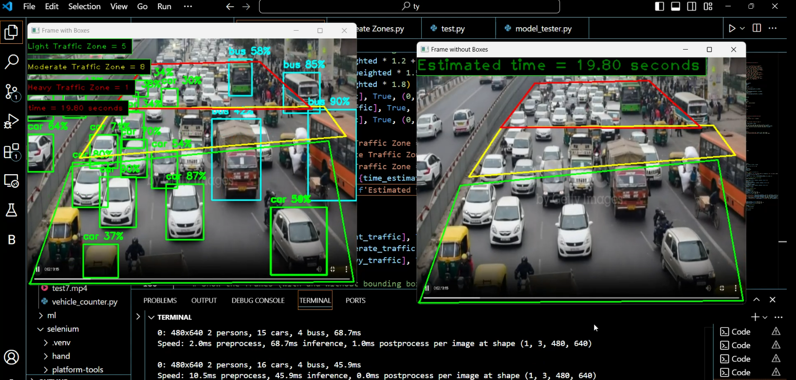

# Dynamic Traffic Control System (Zone-based)

TrafficFlowAnalyzer is a Python-based tool that leverages the YOLO object detection model to analyze traffic flow in video footage. It allows users to define specific traffic zones (light, moderate, heavy) and counts the number of vehicles passing through each zone in real-time. Vehicles are assigned weight based on their effect on traffic flow.


## Demo

Here's how the system works:



## Key Features:
- **Zone Selection**: Allows users to manually define traffic zones on a video frame.
- **Real-Time Traffic Counting**: Detects and counts vehicles in different traffic zones using the YOLO model.
- **Weighted Traffic Analysis**: Provides weighted counts of vehicles based on their type (car, bus, truck) to estimate traffic flow and congestion.
- **Dual Video Output**: Generates two video outputs—one with bounding boxes around detected vehicles and one without, while keeping the zone markings intact.

## Installation

### Prerequisites
- Python 3.x
- Git (for cloning the repository)

### Step-by-Step Installation

1. Clone the repository:
```bash
git clone https://github.com/TJSreeharish/Dynamic_Traffic_Control_Zonebased.git
cd Dynamic_Traffic_Control_Zonebased
```

2. Create and activate a virtual environment (recommended):
```bash
# Windows
python -m venv venv
.\venv\Scripts\activate

# Linux/Mac
python3 -m venv venv
source venv/bin/activate
```

3. Install required dependencies:
```bash
pip install -r requirements.txt
```

4. Additional dependencies:
```bash
pip install opencv-python numpy ultralytics cvzone
```

## Usage

### Setting Up Traffic Zones

1. Open the Create Zone.py file and update the video file location.

2. Run the zone creation tool:
```bash
python Create_Zone.py
```
- Click five points to create a zone
- Press 'q' to save the zone
 ------ or ------
 Update zone coordinates in main.py:
- Replace the values in line 89 with your light traffic zone coordinates:
```python
light_traffic = np.array([[3,477], [634,473], [585,199], [84,249], [6,473]], np.int32)
```
- Repeat for moderate and heavy traffic zones

### Running the Analysis

1. For first-time setup:
```bash
python main.py
```
- Press 'n' to start analysis

2. For new video analysis:
```bash
python main.py
```
- Press 'y'
- Create 3 zones with a total of 15 clicks


## Contributing

Feel free to contribute to this project by:
1. Forking the repository
2. Creating a new branch
3. Making your changes
4. Submitting a pull request

## License

This project is licensed under the MIT License - see the LICENSE file for details.

## Acknowledgments

- YOLO object detection model
- OpenCV community
- All contributors to this project
